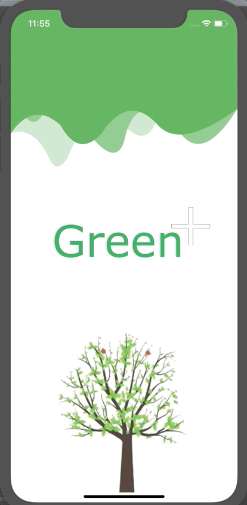

# Green+ - Sustainable Mobility 
The official Green+ App based on Flutter.

### Screenshot

### Getting Started

- Install Flutter: https://flutter.dev/docs/get-started/install

- Use VS Code
- install Extensions:
    - Flutter
    - Flutter Widget Snippets
    - Dart
    - Dart (Syntax Highlighting Only)

### Run

- CMD + SHIFT + P --> Flutter: Launch Emulator
- Go to /lib/main.dart
- Press F5
- DONE  😀

### Credits

Tree animation by GeeskeS https://www.youtube.com/watch?v=kYcIkOTqtcc